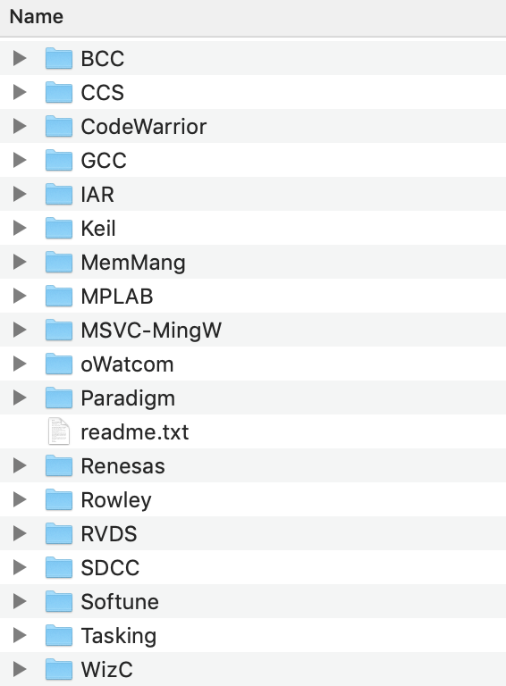
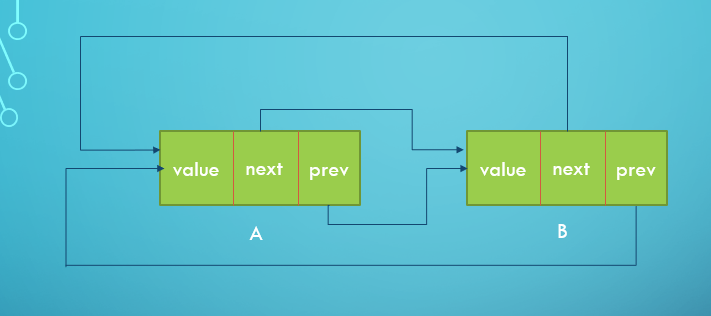
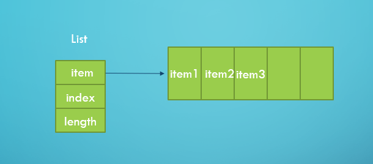

# Rust-FreeRTOS结题报告

我们的项目是利用新兴的Rust语言改写FreeRTOS操作系统。

改写不是抄写。在项目开展的过程中，我们按照FreeRTOS的程序逻辑，针对Rust语言的特点做出了很多富有创造力的设计，我们将在以下部分进行介绍。

最终，我们成功实现了开题时提出的目标，完成了对FreeRTOS中所有的内核模块——**移植（`port`）**模块、**链表**（`list`）模块、**任务调度**（`task`）模块和**队列与信号量**（`queue`）模块——的改写；为了更好地发挥多人协作的作用，我们将以上模块进一步细分，形成了十余个轻量的子模块；截至我们开始撰写结题报告时，我们的总代码量（不包括底层的C语言代码）已经达到了**6000行以上**，git仓库的commits数量**250多次**，小组的每个成员都贡献了大量的代码；此外，我们希望这个项目更加专业，并且能够真正被他人使用，所以我们提供了详细的[文档]()和各个功能的[示例代码](https://github.com/OSH-2019/x-rust-freertos/tree/master/rust_freertos/examples)。

在本报告中，我们首先将对Rust-FreeRTOS项目进行简要介绍，然后重点介绍我们的项目设计，最终介绍我们的测试结果。

我们的小组成员：**樊金昊 左顺 宁雨亭 黄业琦 张俸铭 雷思琦**

[TOC]

## 项目背景
- Rust语言能够提供极高的代码安全性，能够在编译阶段就规避悬垂引用等危险行为，同时在保证数据正确性的情况下实现高效的无锁并发。
- RTOS对程序的响应速度要求、安全性要求很高（如车载电脑，容错率低），因此从代码本身完整性和数据竞争上的安全性优化是比较理想的方式。
- FreeRTOS原操作系统使用C语言编写，而Rust中有Option、Trait、macro等机制，对应能够实现C语言中的指针和数据结构，并在程序编译阶段有更好的安全性表现。因此用Rust实现FreeRTOS是可行且适宜的方案。
- 利用Rust进行RTOS的开发，能够在提高性能和安全性的同时不添加额外的资源开销、保持轻量化。

## 项目设计

### 总体设计概览

#### 细致的模块化设计

原本的FreeRTOS实现中，task模块仅位于`tasks.c`中，queue模块也全部在`queue.c`中实现，这样尽管使代码更加紧凑，但却使代码的可读性大大下降。同时，这也不利于我们小组中多人合作编写代码。

为了使项目结构更加清晰，同时达到每人独立编写一个模块的效果，我们根据功能，对task和queue模块进行了进一步的模块化设计，`task`被分为`kernel`、`task_api`、`task_control`、`task_global`、`task_queue`和`task_timemanager`这六个模块，`queue`也被分为`queue`、`queue_api`、`semaphore`这三个模块。

#### 基于Cargo feature的内核裁剪功能

FreeRTOS中提供了二十余个用于裁剪内核的宏，例如`IncludeTaskDelete`等，我们[利用Cargo的feature功能]，成功实现了FreeRTOS中所有的条件编译，具体技术细节在我们之前写过的[这篇文章](https://github.com/OSH-2019/x-rust-freertos/tree/task/cfg)中，在此不再赘述。条件编译的配置在[Cargo.toml](https://github.com/OSH-2019/x-rust-freertos/blob/880890850098e52a90c335f8e3eb67dfbf38645b/rust_freertos/Cargo.toml#L17)中。

#### 全局变量的处理

FreeRTOS中，处于不同状态的任务队列、内核运行状态等数据都是以全局变量的形式存储的，但是Rust不鼓励使用全局变量，因为它可能造成数据竞争。因为Rust不支持结构体作为全局变量，所以我们使用了[lazy_static](https://docs.rs/lazy_static)包来封装任务链表。此外，我们使用全局mutable变量来存储系统状态，并创建`getter`和`setter`，用`unsafe`统一对其进行访问，例如：

```rust
pub static mut TICK_COUNT: TickType = 0;

#[macro_export]
macro_rules! get_tick_count {
    () => {
        unsafe { crate::task_global::TICK_COUNT }
    };
}

#[macro_export]
macro_rules! set_tick_count {
    ($next_tick_count: expr) => {
        unsafe {
            trace!("TICK_COUNT was set to {}", $next_tick_count);
            crate::task_global::TICK_COUNT = $next_tick_count;
        }
    };
}
```

因为操作系统状态变量只会被内核函数访问，所以此处不会发生数据竞争，可以放心使用`unsafe`。

#### 完善的日志

在上一部分中，我们已经展示了`trace!`函数的使用，在我们的实现中，我们广泛地使用了日志函数，以下是我们某次测试中的一段日志：

```
13:15:11 [TRACE] rust_freertos::task_control: [src/task_control.rs:127] Initialising Task: main, stack size: 512 bytes
13:15:11 [TRACE] rust_freertos::ffi: [src/ffi.rs:40] vTaskSuspendAll() called from ffi!
13:15:11 [TRACE] rust_freertos::kernel: [src/kernel.rs:400] SCHEDULER_SUSPENDED was set to 1
13:15:11 [TRACE] rust_freertos::ffi: [src/ffi.rs:46] xTaskResumeAll() called from ffi!
13:15:11 [TRACE] rust_freertos::kernel: [src/kernel.rs:471] SCHEDULER_SUSPENDED was set to 0
13:15:11 [INFO] task_resume_all() returned false
13:15:11 [TRACE] rust_freertos::task_control: [src/task_control.rs:141] stack_pos for task main is 140500632868624
13:15:11 [TRACE] rust_freertos::task_control: [src/task_control.rs:152] Function ptr of main is at 7FC8DA5016F0
13:15:11 [TRACE] rust_freertos::ffi: [src/ffi.rs:40] vTaskSuspendAll() called from ffi!
13:15:11 [TRACE] rust_freertos::kernel: [src/kernel.rs:400] SCHEDULER_SUSPENDED was set to 1
13:15:11 [TRACE] rust_freertos::ffi: [src/ffi.rs:46] xTaskResumeAll() called from ffi!
13:15:11 [TRACE] rust_freertos::kernel: [src/kernel.rs:471] SCHEDULER_SUSPENDED was set to 0
```

这段日志显示了任务创建的过程。可见，日志让我们的代码执行过程变得可视化。在我们的调试过程中，日志的作用至关重要。

### 硬件接口——Port模块

Port模块是与体系结构相关的，每一个体系结构都有自己的一套port实现，FreeRTOS 8中就提供了面向以下体系结构和编译器的port模块：



这意味着，我们是不可能把每一个port都用Rust改写一遍的。但是，所有的port函数都提供了统一的API接口，所以我们决定利用Rust封装这些API接口。有了这些封装，**我们的代码理论上可以在任何FreeRTOS和LLVM支持的平台上运行**。

因为不同体系结构和编译器上Rust和C语言的接口是不同的，所以以上封装是**由程序自动进行的**，我们使用了[Bindgen](https://github.com/rust-lang/rust-bindgen)工具来生成C代码对应的Rust函数，并利用[CC](https://docs.rs/cc)库来编译C代码，并和Rust程序链接起来，以上过程均在[build.rs](https://github.com/OSH-2019/x-rust-freertos/blob/master/rust_freertos/build.rs)中完成。

因为Bindgen生成的Rust函数是`unsafe`函数，所以我们又在[port.rs](https://github.com/OSH-2019/x-rust-freertos/blob/master/rust_freertos/src/port.rs)中对这些函数进行了一层safe封装，这是Rust中的通行做法；此外，对于C语言中调用的Rust函数，我们也利用Rust的[**FFI**](https://github.com/OSH-2019/x-rust-freertos/blob/master/rust_freertos/src/ffi.rs)为他们生成了对应的C函数。这样，**port层的C代码和Rust代码就可以互相调用了**。

### 基本数据结构——链表

在 FreeRTOS 中，List 的主要作用是辅助任务调度。任务调度是该系统中最重要的一部分，而其任务调度大量使用了链表（list.c 实现），调度器使用链表跟踪不同状态下的任务（就绪、挂起、延时的任务，都会被挂载到各自的链表中）。接下来就讲讲 List 的实现方法。

#### 数据结构

在 C 语言版本中，List 实际上是一个双向链表。在 Rust 实现中，我们**最终**决定采用类似的实现方式来实现 List 。为了完成这部分的工作，首先需要定义与它相关的数据结构。

在 FreeRTOS 中，List 的数据结构主要包括两个部分：`List`和`ListItem`。它们的定义如下：

- C 语言版本：

  - List

    ```c
    typedef struct xLIST
    {
    	configLIST_VOLATILE UBaseType_t uxNumberOfItems;
    	ListItem_t * configLIST_VOLATILE pxIndex;
    	MiniListItem_t xListEnd;
    } List_t;
    ```


  - ListItem

    ```c
    struct xLIST_ITEM
    {
    	configLIST_VOLATILE TickType_t xItemValue;
    	struct xLIST_ITEM * configLIST_VOLATILE pxNext;
    	struct xLIST_ITEM * configLIST_VOLATILE pxPrevious;
    	void * pvOwner;
    	void * configLIST_VOLATILE pvContainer;
    };
    typedef struct xLIST_ITEM ListItem_t;
    ```


- Rust 语言版本：

  - List

    ```rust
    pub struct List {
        number_of_items: UBaseType,
        index: WeakItemLink,
        list_end: ItemLink,
    }
    ```


  - ListItem

    ```rust
    pub struct ListItem {
        item_value: TickType,
        next: WeakItemLink,
        prev: WeakItemLink,
        owner: Weak<RwLock<TCB>>,
        container: Weak<RwLock<List>>,
    }
    ```

    > ```rust
    > // 相关数据类型别名定义
    > pub type ItemLink = Arc<RwLock<ListItem>>;
    > pub type WeakItemLink = Weak<RwLock<ListItem>>;
    > pub type WeakListLink = Weak<RwLock<List>>;
    > pub type ListLink = Arc<RwLock<List>>;
    > ```

#### 实现难题

由于 Rust 语言中存在特殊的 [Ownership](<https://doc.rust-lang.org/nomicon/ownership.html>) ，这给我们实现 List 带来了问题。List 由 ListItem 组成，每个 ListItem 可能会在多个地方被使用而使得 ListItem 的生命周期提前被结束，这并不是我们想要看到的。所以我们需要将相关的数据进行特殊处理。还好，在 Rust 语言中为我们提供了这样的一个结构：`Arc`。它能够统计程序的不同地方对某个变量的引用，并且进行计数。只要存在这样的引用，程序就不会自动释放这个变量，从而确保了变量的有效性。

通过 Arc 将数据包裹起来，就解决了变量被提前释放的问题。但是，通过 Arc 的方式来建立 List ，这样最终会形成一个环路，想象这样的一个场景，一个 List 中只有两个 ListItem。它们的结构如下：



可以发现，在列表项 A 中，`next` 和`prev`都指向了列表项 B 。列表项 B 也同样如此。这就形成了一个引用的闭路。在程序自动回收变量 A 时，由于还存在 B 对它的引用，所以我们必须等到 B 被回收后才能回收 A 。但是同样地，B 的回收也依赖于 A 的回收。这样两个变量就永远不会被回收了，造成了空间上的浪费。看来需要找到一种不存在闭路的引用的实现方式才行。

我们注意到 Rust 语言中存在这样一个数据结构：`vec`。vec 是一个连续，可以增长的数组类型。假设我们将每个 List 定义成一个数组，这样的话 ListItem 就不需要独特的 `prev`和 `next`了，这样的话既节约了空间，又同时消除了引用的闭路，一举两得。



每个 ListItem在数组中的位置可以通过内置的 API 获取，它们的前面和后面的列表项都可以通过它们的本身的 索引值 获取。List 的首元素放在数组的第 0 号位置，其他列表项接着往后存储即可。

这似乎是一种好的解决方案。但是由于 C 语言版本的 List 实现方式是链表，在此采用数组实现，可能会对其他的模块产生相关的影响，影响其他的模块的实现。同时采用 List 也有相关的问题，比如列表项中的对`container`的表示方法可能会需要系统提前声明几个全局的 List ，造成资源的一定程度上的浪费。

看来需要实现的最终方式还是需要链表实现。查询 API 文档，我们发现了与 `Arc`对应的一个结构：`Weak`。它的作用和 Arc 差不多，但是唯一不同的是 [Weak](<https://doc.rust-lang.org/std/sync/struct.Weak.html>) 包裹的变量是不增加引用数的，也就是说，如果采用了 Weak 实现的List，就不存在引用闭路，就消除了这种影响。同时，利用 Rust 语言提供的`upgrade`和`downgrade`函数，可以实现 Weak 和 Arc 之间的转换，合理增删变量的引用数。通过这种方式，我们得到最终的数据结构（见**数据结构**部分的 Rust 实现）。


#### 实现方式

由于最终采用的是类似链表的实现方式，我们基本上可以根据 C 语言的实现细节来实现 Rust 版本的函数。下面提供一个例子来说明：

list.c：

```c
// list.c
void vListInsertEnd( List_t * const pxList, ListItem_t * const pxNewListItem )
{
	ListItem_t * const pxIndex = pxList->pxIndex;

	/* Insert a new list item into pxList, but rather than sort the list,
	makes the new list item the last item to be removed by a call to
	listGET_OWNER_OF_NEXT_ENTRY(). */
	pxNewListItem->pxNext = pxIndex;
	pxNewListItem->pxPrevious = pxIndex->pxPrevious;
	pxIndex->pxPrevious->pxNext = pxNewListItem;
	pxIndex->pxPrevious = pxNewListItem;

	/* Remember which list the item is in. */
	pxNewListItem->pvContainer = ( void * ) pxList;

	( pxList->uxNumberOfItems )++;
}
```

list.rs：

```rust
// list.rs
fn insert_end(&mut self, item_link: WeakItemLink) {
    let prev = get_list_item_prev(&self.index);
    let next = Weak::clone(&self.index);
    set_list_item_next(&item_link, Weak::clone(&next));
    set_list_item_prev(&item_link, Weak::clone(&prev));
    set_list_item_next(&prev, Weak::clone(&item_link));
    set_list_item_prev(&next, Weak::clone(&item_link));

    self.number_of_items += 1;
}
```

这是 `insert_end`的实现方式，首先找到被插入位置的前后两个元素，然后通过相关的操作实现新的列表项的插入，最后再增加 List 的`number_of_items`。实现方式与 C 语言版本基本上差不多。

### TCB和TaskHandle结构体

TCB，即任务控制块，是任务调度的基本单元，TaskHandle是任务句柄，用户通过其实现对任务的各种操作，因为TCB和TaskHandle涉及大量指针操作，所以在这一部分我们花费了大量时间，对原有的结构做出了很多修改。

#### 利用Callback机制调用任务函数

在FreeRTOS原本的实现中，任务初始化堆栈时只需传入指向任务函数的指针即可，但这种方式在Rust中并不可行。在Rust中，一般传递函数的方式是类似如下创建线程的写法：

```rust
use std::thread;

thread::spawn(move || {
    // some work here
});
```

这样的的写法固然可行，但因为堆栈初始化是在port中完成的，我们的任务函数必须被传入C代码中，且任务函数必须符合以下声明。那么，如何将Rust中的`closure`传入C代码中呢？

```c
typedef void (*TaskFunction_t)( void * );
```

我们参考[这篇回答](https://stackoverflow.com/questions/32270030/how-do-i-convert-a-rust-closure-to-a-c-style-callback)，每次初始化时，都传入一个符合以上定义的wrapper函数，将我们要调用的函数作为它的参数，做如下处理：

```rust
// `func` is the function we want to run.
let f = Box::new(Box::new(func) as Box<FnBox()>); // Pass task function as a parameter.
let param_ptr = &*f as *const _ as *mut _; // Convert to raw pointer.
let result = port::port_initialise_stack(top_of_stack as *mut _, Some(run_wrapper), param_ptr);
```

这样，C语言代码中实际调用的函数是：

```rust
/* Task call wrapper function. */
extern "C" fn run_wrapper(func_to_run: CVoidPointer) {
    unsafe {
        let func_to_run = Box::from_raw(func_to_run as *mut Box<FnBox() + 'static>);
        func_to_run();
    }
}
```

通过解引用它的参数，我们获得了真正要运行的closure。此外，还必须要在任务堆栈初始化成功后手动`forget`即将被运行的函数，以免Rust的内存管理机制在初始化函数执行结束后将其free掉：

```rust
match result {
    Ok(_) => {
         /* We MUST forget `f`, otherwise it will be freed at the end of this function.
          * But we need to call `f` later in `run_wrapper`, which will lead to
          * some unexpected behavior.
          */
         mem::forget(f);
     }
    Err(e) => return Err(e),
}
```

#### TaskHandle类型

在原本的C代码中，TaskHandle是一个指针（实际上是一个指向TCB的指针）：

```c
typedef void * TaskHandle_t;
```

事实上，FreeRTOS利用`void *`实现了类似多态的类型转换，这显然是不安全的，所以Rust不允许这样的类型转换。因为可能会有多个`TaskHandle`同时指向并有权修改同一个TCB，我们采用智能指针对其进行封装：

```rust
#[derive(Clone)]
pub struct TaskHandle(Arc<RwLock<TCB>>);
```

这一定义与链表中的`owner`域定义类似，所有与任务相关的函数，都是以TaskHandle为参数的，这使得Task的使用很灵活。

#### DRY (Don't repeat yourself)

由上一部分可以看出，TaskHandle、List、ListItem的定义都采用了多层智能指针封装，他们的定义比较复杂。事实上，由于涉及到多次对智能指针的操作，他们的使用也非常复杂。例如，下面是一个判断两个TaskHandle是否指向同一TCB的函数。

```rust
impl PartialEq for TaskHandle {
    fn eq(&self, other: &Self) -> bool {
        *self.0.read().unwrap() == *other.0.read().unwrap()
    }
}
```

可见，智能指针的操作会让代码变得冗长、可读性降低，若涉及多个智能指针操作，则可读性更差，而且这些操作大多是重复的。与此类似的，还有获取当前执行的任务等，

### 任务控制函数

#### 任务创建

```rust
pub fn initialise<F>(mut self, func: F) -> Result<TaskHandle, FreeRtosError>
    where
        F: FnOnce() -> () + Send + 'static,
```

我们将任务创建和任务信息初始化的函数合一处理。

首先为任务申请空间，栈空间我们采用字对齐处理，实现如下。

```rust
let px_stack = port::port_malloc(stacksize_as_bytes)?;
```

之后标记栈空间信息。

```rust
let mut top_of_stack = self.stack_pos + self.task_stacksize as StackType - 1;
top_of_stack = top_of_stack & portBYTE_ALIGNMENT_MASK as StackType;
```

申请空间如果失败，则会返回`Err`信息，我们不作处理；如果申请成功，我们则会装入TCB的相关信息和数据。例如：任务名称，任务函数信息，任务函数参数信息，任务优先级等等……

除了这些信息，还有两个任务相关的列表项要被初始化，`state_list_item`以及`event_list_item`用于任务队列调度。

最后我们将初始化完成的任务放置在就绪队列`ready_list`中。

```rust
handle.add_new_task_to_ready_list()?;
```

就此，任务穿件过程完毕。

详见`task_control L182-L279`


#### 添加任务至就绪列表

之前再创建任务的时候也有使用过，我们创建的任务需要加入就绪列表中。

```rust
fn add_new_task_to_ready_list(&self) -> Result<(), FreeRtosError>
```

在这个过程中，为了保证正确性，我们先进入临界区，使用我们已经编写好的`taskENTER_CRITICAL!()`和`taskEXIT_CRITICAL!()`API。

我们添加新任务同时，我们将一些辅助维护的全局变量也加以维护。

例如：`current_number_of_tasks`

之后调用`list API`完成添加。

详见`task_control L527-L571`。


#### 任务删除

```rust
pub fn task_delete(task_to_delete: Option<TaskHandle>)
```

首先先使用`get_handle_from_option`转换数据类型，方便之后处理。

与之前添加任务一样，删除任务时，我们也需要进入临界区进行操作。

进入临界区之后步骤如下：

1. 将任务从就序列表中删除，如果成功删除，则重置优先级

2. 判断任务是否在等待事件，如果是，则删除任务对应的`event_list_item`

3. 如果删除的任务是正在运行的任务，则需要多执行一次任务切换过程


由于删除任务我们需要删除任务控制块以及任务堆栈所占用的空间，但是任务正在运行的话，显然任务控制块和任务堆栈不能直接释放，我们需要设置标记，将任务移动到`task_waiting_termination`列表。之后在一一释放内存。

详见`task_control L815-L889`。


#### 任务挂起

```rust
pub fn suspend_task(task_to_suspend: TaskHandle)
```

同样，先转换变量类型，再进入临界区。

步骤如下：

1. 将任务从就序列表或者延迟列表中移除
2. 判断任务是否在等待事件，如果是，则删除任务对应的`event_list_item`

至此可以离开临界区，因为之后添加任务至挂起列表操作是不需要再临界取中执行的。

接着，我们计算还要多长时间执行下一个任务，也就是任务的解锁时间，防止有任务参考了刚才被挂起的任务，我们使用`reset_next_task_unblock_time()`函数进行处理。

还存在一个特例——需要挂起的任务是正在执行的任务。如果这种情况发生，我们需要特殊处理，再任务调度器没有异常的情况下，我们调用函数`portYIELD_WITHIN_API!()`进行强制切换。切换完之后还不算结束，因为我们的全局变量`current_tcb`指向我们正在执行的任务，当他被挂起之后，我们需要再找一个其他的任务放在里面。

假如没有其他被挂起的任务，我们调用`task_switch_context()`获取下一个要执行的任务。

详见`task_control L913-L975`。


#### 任务恢复

```rust
pub fn resume_task(task_to_resume: TaskHandle)
```

首先我们有两种情况比较特殊，不能恢复：

1. 要我们恢复的任务为NULL
2. 要恢复的就是当前正在执行的任务

如果不是这两中情况，则可以进入临界区进行操作：

1. 先判定任务是否已经被挂起，调用函数`task_is_tasksuspended()`
2. 将要恢复的任务从挂起列表中移除
3. 将要恢复的任务放进就序列表中
4. 如果要恢复的任务优先级高于当前正在执行的任务，调用`taskYIELD_IF_USING_PREEMPTION!()`进行任务切换

详见`task_control L1031-L1065`。


#### 任务挂起判定

```rust
pub fn task_is_tasksuspended(xtask: &TaskHandle) -> bool
```

简单地说，是利用`list API`对于挂起列表进行查询。

详见`task_control L977-L1006`。


#### 任务延迟函数

```rust
pub fn task_delay(ticks_to_delay: TickType)
```

参数为我们需要延迟的节拍数，延迟节拍数小于0时，相当于直接执行了`port_YIELD`进行任务切换。

如果延迟节拍数大于0，我们先挂起任务调度器，利用函数`add_current_task_to_delayed_list()`将我们要延迟的任务移动到`delay_list`中，之后再恢复任务调度器。如果此时任务调度器没有调度任务，我们手动调用`portYIELD_WITHIN_API!()`进行调度。

详见`task_timemanager L55-L77`。


#### 将任务添加至延迟队列中

```rust
pub fn add_current_task_to_delayed_list(ticks_to_wait: TickType, can_block_indefinitely: bool)
```

详见`task_control L650-L750`。

### 任务API函数

#### Task_API模块用途
- 该模块中主要实现几个任务相关的API函数，它们的作用主要是便于用户在执行过程中与操作系统进行交互，其中包括获取当前任务的状态信息（主要是基于taskTCB），并能够赋予使用者以一定的接口来改变任务属性，其中尤其重要的是task_priority_set()函数，它使用户能够手动更新任务的优先级，从而按照用户预期的方式进行任务调度。

- 我们综合考虑到函数的重要性和使用频率，利用Rust实现了API的其中一部分常用函数。

#### Rust实现
- **实现函数**
```rust
pub fn task_priority_get(xTask: Option<TaskHandle>) -> UBaseType
pub fn task_priority_set(xTask: Option<TaskHandle>, uxNewPriority: UBaseType)

pub fn task_get_handle(pcNameToQuery:&char) -> &TaskHandle
pub fn task_get_system_state(pxTaskStatusArray:&TaskStatus , uxArraySize:UBaseType , pulTotalRunTime:u32) -> UBaseType
pub fn task_test_info(xTask:Option<&TaskHandle>, pxTaskStatus:&TaskStatus, xGetFreeStackSpace:BaseType, eState:TaskState)
pub fn task_get_application_task_tag(xTask:TaskHandle) -> UBaseType
pub fn task_get_idle_task_handle() -> &TaskHandle
pub fn task_get_stack_high_water_mark(xtask:Option<&TaskHandle>) -> UBaseType
```

- **技术点**
在Rust改写过程中，一个比较麻烦的问题是如何实现原函数中TaskHandle的访问。由于Rust对变量的所有权和生命期规定非常严格，因而使用以全局变量为参数的函数的方式会导致混乱。因此我们决定采用灵活的宏定义方式来实现，免除了参数生命期结束的困扰。
如下面的获取任务tcb函数：

```rust
macro_rules! get_tcb_from_handle_inAPI {
    ($task:expr) => {
        match $task {
            Some(t) => t,
            None => get_current_task_handle!(),
        }
    };
}
```

### Queue 队列

在没有操作系统的时候，两个应用程序进行消息传递一般是使用全局变量的方式；但是如果在使用操作系统的应用中用全局变量来传递消息，则会涉及资源管理的问题。FreeRTOS对此提供了一个叫"队列"的机制来完成任务与任务、任务与中断之间的消息传递。

#### 数据结构

在Rust中，我们使用和C语言中类似的数据结构，但为了让Queue可以在不同线程中共享，我们为其实现interior mutability。

- C语言版本：

  ```c
  typedef struct QueueDefinition
  {
  	int8_t *pcHead;
  	int8_t *pcTail;
  	int8_t *pcWriteTo;

  	union
  	{
  		int8_t *pcReadFrom;
  		UBaseType_t uxRecursiveCallCount;
  	} u;

  	List_t xTasksWaitingToSend;
  	List_t xTasksWaitingToReceive;

  	volatile UBaseType_t uxMessagesWaiting;
  	UBaseType_t uxLength;
  	UBaseType_t uxItemSize;

  	volatile int8_t cRxLock;
  	volatile int8_t cTxLock;

  	#if( ( configSUPPORT_STATIC_ALLOCATION == 1 ) && ( configSUPPORT_DYNAMIC_ALLOCATION == 1 ) )
  		uint8_t ucStaticallyAllocated;
  	#endif

  	#if ( configUSE_QUEUE_SETS == 1 )
  		struct QueueDefinition *pxQueueSetContainer;
  	#endif

  	#if ( configUSE_TRACE_FACILITY == 1 )
  		UBaseType_t uxQueueNumber;
  		uint8_t ucQueueType;
  	#endif

  } xQUEUE;

  typedef xQUEUE Queue_t;
  ```

- Rust语言版本：

  - QueueDefinition

    ```rust
    #[derive(Default)]
    pub struct QueueDefinition<T>
    where
        T: Default + Clone,
    {
        pcQueue: VecDeque<T>,

        pcHead: UBaseType,
        pcTail: UBaseType,
        pcWriteTo: UBaseType,

        /*pcReadFrom & uxRecuriveCallCount*/
        QueueUnion: UBaseType,

        xTasksWaitingToSend: ListLink,
        xTasksWaitingToReceive: ListLink,

        uxMessagesWaiting: UBaseType,
        uxLength: UBaseType,
        cRxLock: i8,
        cTxLock: i8,

        #[cfg(all(
            feature = "configSUPPORT_STATIC_ALLOCATION",
            feature = "configSUPPORT_DYNAMIC_ALLOCATION"
        ))]
        ucStaticallyAllocated: u8,

        #[cfg(feature = "configUSE_QUEUE_SETS")]
        pxQueueSetContainer: Option<Box<QueueDefinition>>,

        #[cfg(feature = "configUSE_TRACE_FACILITY")]
        uxQueueNumber: UBaseType,
        //#[cfg(feature = "configUSE_TRACE_FACILITY")]
        ucQueueType: QueueType,
    }
    ```

    所作修改：

    在Rust中，我们使用`VecDeque`类型存储队列内容，`pcHead`、`pcTail`、`pcWriteTo`依然指向相应位置，但其类型为`UBaseType`。

    Rust语言中，用作队列时的`pcReadFrom`和用作递归互斥量时的`uxRecursiveCallCount`均为`UBaseType`类型，因此无需使用union，将其合并成一个变量`QueueUnion`，在不同情况下使用即可。

    在Rust中将消息类型设为泛型T，无需手动设定`uxItemSize`	，只需传入消息类型即可。


  - Queue

    ```rust
    pub struct Queue<T>(UnsafeCell<QueueDefinition<T>>)
    where
        T: Default + Clone;
    unsafe impl<T: Default + Clone> Send for QueueIM<T> {}
    unsafe impl<T: Default + Clone> Sync for QueueIM<T> {}
    ```

    由于我们不能让两个任务共享对Queue的mut引用，这显然是违背Rust的所有权的。然而`send`和`receive`方法都需要对Queue进行mut引用。

    为了避免这个问题，我们需要把这些方法改为immutable引用，并为队列实现interior mutability。实现`send`和`sync`是为了让Queue可以在不同线程中共享。

    例如为Queue实现interior mutability的`send`方法：

    ```rust
    pub fn send(&self, pvItemToQueue: T, xTicksToWait: TickType) -> Result<(),QueueError> {
    	unsafe {
    		let inner = self.0.get();
    		(*inner).queue_generic_send(pvItemToQueue, xTicksToWait, queueSEND_TO_BACK)
    		}
    }
    ```

    尽管这里使用了许多`unsafe`代码，但因为我们的QueueDefinition中的`receive`和`send`方法内实现了同步阻塞机制，所以不会造成数据竞争，我们的代码还是安全的。通过interior mutability的方式，就可以让Queue作为一个immutable的引用在不用线程间愉快地共享了。


#### 实现方式

用作队列时，大部分实现逻辑都与C语言中逻辑相同。

在C语言实现中，`queue.h`多为宏，实为调用`queue.c`中的函数。在Rust语言实现中，为`QueueDefinition`实现的方法为`queue.c`中的函数，如`xQueueGenericSend()`实现为`QueueDefinition`的方法

```rust
pub fn queue_generic_send(
  &mut self,
  pvItemToQueue:T,
  xTicksToWait:TickType,
  xCopyPosition:BaseType
) -> Result<(),QueueError>
```

，为`Queue`实现的方法为`queue.h`中的宏，如`xQueueSend()`实现为`Queue`的方法

```rust
pub fn send(&self, pvItemToQueue:T,xTicksToWait:TickType) -> Result<(),QueueError>
```

在Rust中返回值与C语言中有所不同，例如`receive`方法中使用`Result<T,QueueError>`类型作为返回值，若成功从Queue中接收到一个消息，则通过`Ok(T)`返回，若失败则返回相应的`Err(QueueError)`。


### Semaphore 信号量

信号量是操作系统中很重要的一部分，一般涌来进行资源管理和任务同步。FreeRTOS中的信号量又分为二值信号量、计数型信号量、互斥信号量和递归互斥信号量。

#### 数据结构

类似于队列的实现，为信号量实现Interior mutability。

```rust
pub struct Semaphore(UnsafeCell<QueueDefinition<Option<TaskHandle>>>);
unsafe impl Send for Semaphore {}
unsafe impl Sync for Semaphore {}
```

Semaphore的数据结构其实和C语言实验有较大不同。

在C语言中，

```c
#define pxMutexHolder					pcTail
#define uxQueueType						pcHead
#define queueQUEUE_IS_MUTEX				NULL
```

若Queue被用作信号量使用，则无需存储消息，`pcTail`被用作`pxMutexHolder`，`pcHead`被用作`uxQueueType`，若`pcHead == NULL`，即表示`uxQueueType == queueQUEUE_IS_MUTEX`。

而在Rust语言中，我们将信号量的Holder保存在消息队列`pcQueue`中，数据结构中原先只在调试时使用的`ucQueueType`现在始终使用，用于保存Queue类型，即判断是否作为队列或信号量使用。

#### 实现方式

由于信号量的数据结构和C语言有较大不同，各个函数的实现也区别较大。

##### 创建

以互斥信号量的创建为例：

```rust
pub fn new_mutex() -> Self {
  Semaphore(UnsafeCell::new(QueueDefinition::new(1,QueueType::Mutex)))
}
```

各个信号量的创建均类似。


##### 泛型T和`Option<task_control::TaskHandle>`的转换

由于我们在信号量中仍使用了`QueueDefinition`，但在此`T`应为`TaskHandle`，需要使用一些`TaskHandle`的相关函数，这时就会出现`T`和`Option<task_control::TaskHandle>`之间的类型错误。

我们通过两个函数实现`T`与`Option<task_control::TaskHandle>`之间的转换。

```rust
pub fn transed_task_handle_for_mutex(&self) -> Option<task_control::TaskHandle>
```

```rust
fn transed_task_handle_to_T<T>(task_handle: Option<task_control::TaskHandle>) -> T
```

我们以`transed_task_handle_for_mutex`为例：

如果`pcQueue`的0号元素非空的话，则使用unsafe进行类型转换，将泛型T转换为`Option<task_control::TaskHandle>`类型。否则直接返回`None`即可。

```rust
if self.pcQueue.get(0).cloned().is_some() {
	let untransed_task_handle = self.pcQueue.get(0).cloned().unwrap();
	let untransed_task_handle = Box::new(untransed_task_handle);
	let mut task_handle: Option<task_control::TaskHandle>;
	unsafe {
		let transed_task_handle = std::mem::transmute::<
			Box<T>,
			Box<Option<task_control::TaskHandle>>,
		>(untransed_task_handle);
		task_handle = *transed_task_handle
	}
	task_handle
}
else {
	None
}
```


##### 获取信号量

```rust
pub fn semaphore_down(&self, xBlockTime: TickType) -> Result<(), QueueError>
```

二值信号量、计数型信号量、互斥信号量均使用此函数获取信号量，此函数其实是调用了`queue_generic_send()`完成。这里与C语言中实现有很大不同，C语言中调用了`queue_generic_receive()`。但由于我们使用`pcQueue`保存`MutexHolder`，使用`send`函数将获取此信号量的`Task Handle`传入队列中，即表示此任务获取了信号量。

下面我们以互斥信号量为例，来看一下在`queue_generic_send()`中对信号量的处理。

获取信号量其实就是将此任务的TaskHandle作为消息传给队列。在`queue_generic_send()`中，主要在函数`copy_data_to_queue()`中进行：

```rust
if self.ucQueueType == QueueType::Mutex || self.ucQueueType == QueueType::RecursiveMutex
	{
		let mutex_holder = transed_task_handle_to_T(task_increment_mutex_held_count());
		self.pcQueue.insert(0, mutex_holder);
	} else {
		mtCOVERAGE_TEST_MARKER!();
	}
```

如果是互斥信号量，则需要将当前任务的任务控制块传给`pcQueue`，在这里通过函数`task_increment_mutex_hold_count()`得到当前任务控制块，并给任务控制块中的`uxMutexesHeld`加一，表示任务获取了一个互斥信号量。

如果队列已满，即表示此互斥信号量已被其他任务获取，此时应该调用`task_priority_inherit()`函数处理优先级继承问题，判断当前任务的任务优先级是否比正在拥有互斥信号量的任务优先级高，如果是则把拥有互斥信号量的低优先级任务的优先级调整为与当前任务相同的优先级。


##### 释放信号量

```rust
pub fn semaphore_up(&self) -> Result<Option<TaskHandle>, QueueError>
```

二值信号量、计数型信号量、互斥信号量均使用此函数获取信号量，此函数其实是调用了`queue_generic_receive()`完成。这里与C语言中实现有很大不同，C语言中调用了`queue_generic_send()`。但由于我们使用`pcQueue`保存`MutexHolder`，使用`receive`函数将获取此信号量的`Task Handle`从队列中移除，即表示此任务释放了互斥信号量。

下面我们以互斥信号量为例，来看一下在`queue_generic_receive()`中对信号量的处理。

由于释放互斥信号量后，需要调用`task_priority_disinherit()`函数处理互斥信号量的优先级继承问题。`task_priority_disinherit()`的返回值作为`xYieldRequired`变量的值，若为true则表示需要进行任务调度。


##### 递归互斥信号量

递归互斥信号量是一种特殊的互斥信号量。获取和释放递归互斥信号量时，需要维护`uxRecursiveCallCount`(在Rust语言实现中为`QueueUnion`)。其余实现和互斥信号量相同。


## 测试

### 功能正确性

我们关于功能正确性的测试写在`lib.rs`里。

### 性能测试

#### 性能指标

为了将`C-FreeRTOS`性能和我们的`Rust-FreeRTOS`性能进行比较，我们这里找了四个具体的算例对他们的性能呢过进行比较，分别是：
1. 我们自己编写的测试，创建15个任务，计算50的阶乘
2. Freertos官方Demo里的例子，编号WIN32-WCNM
3. Freertos官方Demo里的例子，编号ARM-aejs327
4. Freertos官方Demo里的例子，编号ColdFire-MCF52221

#### C性能测试方法
计时代码如下：
``` C++
inline unsigned long long rdtsc(void)
{
        unsigned long hi = 0, lo = 0;

        __asm__ __volatile__ ("lfence;rdtsc" : "=a"(lo), "=d"(hi));

        return (((unsigned long long)lo))|(((unsigned long long)hi)<<32);
}

start = rdtsc ();
...
end = rdtsc ();
```

#### Rust性能测试方法
这里使用`Cargo benchtest`工具，设置`#[bench]`块，测试块内代码耗时。
具体见`lib.rs L60-L163`

## 总结与不足

#### 总结

在没有Rust经验也缺乏操作系统知识的情况下，我们最终用250多次commit完成了6000多行代码，几乎实现了FreeRTOS的所有功能，在我们自己看来，Rust-FreeRTOS项目是很成功的。我们认为成功的原因主要是：

1. 我们整个项目进展比较早。我们确立选题、Rust学习、开始编码都比较早，同时我们每周二、周日碰面两次，这使我们整个项目推进较快。
2. 我们结合对FreeRTOS的模块化设计，进行了明确的分工，并且从未改变，每个人各得其所。
3. 我们的设计是自底向上的，下层的基础模块为上层提供了良好的封装，使得可以迅速编写出大量的上层代码。

#### 我们的不足

不论是在设计上还是工程的实施上，我们都犯了很多错误，其中有些错误直到最终也没有进行修正：

1. 我们没有消灭所有的全局变量。这不是Rust鼓励的实现方式，事实上，这给我们的编程带来了很大的困难。
2. 我们使用了`std`库，但是没有自己实现它，但是一个真正的操作系统是要自己实现`std`库。
3. 一个可能的不足：我们在代码中使用了过多的智能指针（`Arc` \ `Weak` \ `RwLock`），它们基于操作系统的信号量机制，容易造成死锁（我们在调试的过程中就多次出现死锁）
