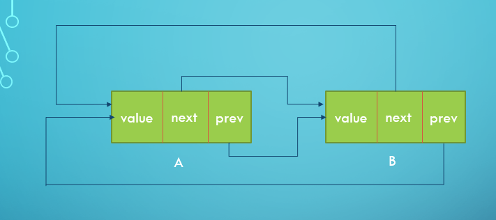
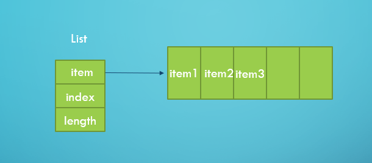

## List结题报告

在 FreeRTOS 中，List 的主要作用是辅助任务调度。任务调度是该系统中最重要的一部分，而其任务调度大量使用了链表（list.c 实现），调度器使用链表跟踪不同状态下的任务（就绪、挂起、延时的任务，都会被挂载到各自的链表中）。接下来就讲讲 List 的实现方法。

### 数据结构

在 C 语言版本中，List 实际上是一个双向链表。在 Rust 实现中，我们**最终**决定采用类似的实现方式来实现 List 。为了完成这部分的工作，首先需要定义与它相关的数据结构。

在 FreeRTOS 中，List 的数据结构主要包括两个部分：`List`和`ListItem`。它们的定义如下：

+ C 语言版本：

  + List

    ```c
    typedef struct xLIST
    {
    	configLIST_VOLATILE UBaseType_t uxNumberOfItems;
    	ListItem_t * configLIST_VOLATILE pxIndex;		
    	MiniListItem_t xListEnd;					
    } List_t;
    ```

    

  + ListItem

    ```c
    struct xLIST_ITEM
    {
    	configLIST_VOLATILE TickType_t xItemValue;			
    	struct xLIST_ITEM * configLIST_VOLATILE pxNext;		
    	struct xLIST_ITEM * configLIST_VOLATILE pxPrevious;	
    	void * pvOwner;										
    	void * configLIST_VOLATILE pvContainer;				
    };
    typedef struct xLIST_ITEM ListItem_t;
    ```

    

+ Rust 语言版本：

  + List

    ```rust
    pub struct List {
        number_of_items: UBaseType,
        index: WeakItemLink,
        list_end: ItemLink,
    }
    ```

    

  + ListItem

    ```rust
    pub struct ListItem {
        item_value: TickType,
        next: WeakItemLink,
        prev: WeakItemLink,
        owner: Weak<RwLock<TCB>>,
        container: Weak<RwLock<List>>,
    }
    ```

    > ```rust
    > // 相关数据类型别名定义
    > pub type ItemLink = Arc<RwLock<ListItem>>;
    > pub type WeakItemLink = Weak<RwLock<ListItem>>;
    > pub type WeakListLink = Weak<RwLock<List>>;
    > pub type ListLink = Arc<RwLock<List>>;
    > ```

### 实现难题

由于 Rust 语言中存在特殊的 [Ownership](<https://doc.rust-lang.org/nomicon/ownership.html>) ，这给我们实现 List 带来了问题。List 由 ListItem 组成，每个 ListItem 可能会在多个地方被使用而使得 ListItem 的生命周期提前被结束，这并不是我们想要看到的。所以我们需要将相关的数据进行特殊处理。还好，在 Rust 语言中为我们提供了这样的一个结构：`Arc`。它能够统计程序的不同地方对某个变量的引用，并且进行计数。只要存在这样的引用，程序就不会自动释放这个变量，从而确保了变量的有效性。

通过 Arc 将数据包裹起来，就解决了变量被提前释放的问题。但是，通过 Arc 的方式来建立 List ，这样最终会形成一个环路，想象这样的一个场景，一个 List 中只有两个 ListItem。它们的结构如下：



可以发现，在列表项 A 中，`next` 和`prev`都指向了列表项 B 。列表项 B 也同样如此。这就形成了一个引用的闭路。在程序自动回收变量 A 时，由于还存在 B 对它的引用，所以我们必须等到 B 被回收后才能回收 A 。但是同样地，B 的回收也依赖于 A 的回收。这样两个变量就永远不会被回收了，造成了空间上的浪费。看来需要找到一种不存在闭路的引用的实现方式才行。

我们注意到 Rust 语言中存在这样一个数据结构：`vec`。vec 是一个连续，可以增长的数组类型。假设我们将每个 List 定义成一个数组，这样的话 ListItem 就不需要独特的 `prev`和 `next`了，这样的话既节约了空间，又同时消除了引用的闭路，一举两得。



每个 ListItem	在数组中的位置可以通过内置的 API 获取，它们的前面和后面的列表项都可以通过它们的本身的 索引值 获取。List 的首元素放在数组的第 0 号位置，其他列表项接着往后存储即可。

这似乎是一种好的解决方案。但是由于 C 语言版本的 List 实现方式是链表，在此采用数组实现，可能会对其他的模块产生相关的影响，影响其他的模块的实现。同时采用 List 也有相关的问题，比如列表项中的对`container`的表示方法可能会需要系统提前声明几个全局的 List ，造成资源的一定程度上的浪费。

看来需要实现的最终方式还是需要链表实现。查询 API 文档，我们发现了与 `Arc`对应的一个结构：`Weak`。它的作用和 Arc 差不多，但是唯一不同的是 [Weak](<https://doc.rust-lang.org/std/sync/struct.Weak.html>) 包裹的变量是不增加引用数的，也就是说，如果采用了 Weak 实现的List，就不存在引用闭路，就消除了这种影响。同时，利用 Rust 语言提供的`upgrade`和`downgrade`函数，可以实现 Weak 和 Arc 之间的转换，合理增删变量的引用数。通过这种方式，我们得到最终的数据结构（见**数据结构**部分的 Rust 实现）。


### 实现方式

由于最终采用的是类似链表的实现方式，我们基本上可以根据 C 语言的实现细节来实现 Rust 版本的函数。下面提供一个例子来说明：

list.c：

```c
// list.c
void vListInsertEnd( List_t * const pxList, ListItem_t * const pxNewListItem )
{
	ListItem_t * const pxIndex = pxList->pxIndex;

	/* Insert a new list item into pxList, but rather than sort the list,
	makes the new list item the last item to be removed by a call to
	listGET_OWNER_OF_NEXT_ENTRY(). */
	pxNewListItem->pxNext = pxIndex;
	pxNewListItem->pxPrevious = pxIndex->pxPrevious;
	pxIndex->pxPrevious->pxNext = pxNewListItem;
	pxIndex->pxPrevious = pxNewListItem;

	/* Remember which list the item is in. */
	pxNewListItem->pvContainer = ( void * ) pxList;

	( pxList->uxNumberOfItems )++;
}
```

list.rs：

```rust
// list.rs
fn insert_end(&mut self, item_link: WeakItemLink) {
    let prev = get_list_item_prev(&self.index);
    let next = Weak::clone(&self.index);
    set_list_item_next(&item_link, Weak::clone(&next));
    set_list_item_prev(&item_link, Weak::clone(&prev));
    set_list_item_next(&prev, Weak::clone(&item_link));
    set_list_item_prev(&next, Weak::clone(&item_link));

    self.number_of_items += 1;
}
```

这是 `insert_end`的实现方式，首先找到被插入位置的前后两个元素，然后通过相关的操作实现新的列表项的插入，最后再增加 List 的`number_of_items`。实现方式与 C 语言版本基本上差不多。

